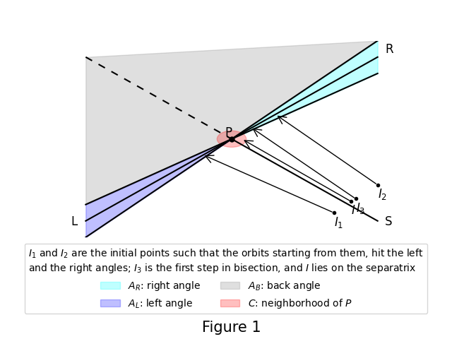

# Simulating Birkhoff billiards in Python

by Misha Byaly, Baruch Youssin

## Summary: TL;DR

This repository contains the code we created during our (unsuccessful)
attempt to disprove the Birkhoff-Poritsky conjecture for a specific billiard.

The repository includes:

- A library for simulating general Birkhoff billiards with boundaries defined
analytically via their support functions.
- Scripts used to simulate a particular billiard table we studied.

The billiard boundary we used, is nice, simple and analytic. Nevertheless,
our results show chaotic behavior (intersecting separatrices) only
at distances of about $10^{-46}$ from a hyperbolic periodic point of order 9.
Orbits passing near this point at
distances of $10^{-19}$ - $10^{-21}$ do not exhibit any chaotic behavior.

## Mathematical summary

The Birkhoff-Poritsky conjecture posits that ellipses are the only integrable billiards
in the plane.
We studied a specific billiard table (defined below) that is rotationally symmetric
with respect to an angle of $\pi/3$ and possesses an invariant curve of 6-periodic orbits.

Our experiments demonstrate non-integrability of this billiard due to
the complex behavior of separatrices near hyperbolic periodic points.

For the conjecture, relevant references, and the concept of support functions
used to define billiard boundaries, see [[1]](#1).

<a id="1">[1]</a> 
The Birkhoff-Poritsky conjecture for centrally-symmetric billiard tables.
Bialy, Misha; Mironov, Andrey E. 
Ann. of Math. (2) 196 (2022), no. 1, 389–413.
[https://doi.org/10.4007/annals.2022.196.1.2](https://doi.org/10.4007/annals.2022.196.1.2)
 [MR4429262](https://mathscinet.ams.org/mathscinet/article?mr=4429262)

## Survey of the code

### Directory contents

`lib`: Contains libraries for implementing billiard simulations and related tasks:
- `general_lib` contains the code that implements the billiard simulations
taking the billiard boundary as a parameter. 
It also contains other general purpose code.
It defines an interface `AbstractBilliard` that includes the support function
that is used to define a billiard; this interface is used as a parameter
that specifies the billiard boundary. 
Here are the most important functions to call in this module:
  - `general_lib.calculate_orbit`: creates an orbit (as a `numpy` array)
for a specified starting point and a number of iterations to take.
  - `general_lib.create_validate_orbit_by_blocks`: creates, validates and
saves orbit to a file. This is done by blocks of specified size, and the progress
is saved to files so that the process can be restarted from the most recent
block, if stopped for any reason.
Validation is done by calculating the same orbit with higher precision and
comparing the results.
  - `general_lib.SearcherForSeparatrix.orbit_hit_hyperbolic_point`: finds one
orbit that lies on the separatrix, using the bisection algorithm given below.
  - `general_lib.SearcherForSeparatrix.fill_separatrix`: fills the separatrix
by orbits.
  - `general_lib.create_validate_separatrix_by_blocks`: creates, validates and
saves a separatrix to a file.
This is done by blocks of orbits specified size, and the progress
is saved to files so that the process can be restarted from the most recent
block, if stopped for any reason.
Validation is done by calculating the same separatrix with higher precision and
comparing the results.
- `billiard_Birkhoff_lib` contains a class, `BirkhoffBilliard_k_A`, which
implements the interface `general_lib.AbstractBilliard` for
the specific billiard boundary we simulate.
This class also contains envelopes for the functions of `general_lib`
that build orbits and separatrices by blocks; these envelope functions,
in addition to using this specific boundary, also hard-code
the directories where the files containing orbits and separatrices are placed:
`orbits/k3A0.5` for orbits and `orbits/k3A0.5/separatrices` for separatrices.
- `plotting_lib` contains the code that plots orbits and separatrices created
by functions defined in `general_lib`.
- `colors_lib` contains functions related to colors.

`tests` contains extensive tests for modules in `lib`.

`create_orbits/k3A0.5` contains the scripts that simulate our
billiard and create orbits and separatrices by calling the library
functions.
(The subdirectory `k3A0.5` stands for the values of the parameters `k` and `A`
in our definition of the billiard boundary, see below.)
These scripts take many hours and days to run, as indicated in the comments
at the end of each script.
Here is the list of these scripts:
- `periodic_orbit_k3A0.5.py` finds the hyperbolic periodic orbit of order 9,
and finds the eigenvalues of the 9th iteration of the billiard map at
points of this orbit.  (This script runs quickly, in a matter of minutes.)
- `above_left_1.py` and `left_down_1.py` calculate orbits that pass
at distances of
$10^{-19}$ - $10^{-21}$ from the above hyperbolic periodic orbit.
These orbits do not show any sign of chaos.
- The six scripts `separatrix_9_down_left_50_...` create pieces of the separatrix
that approaches the hyperbolic periodic point with $\phi=\pi/3$ from the down left
direction. (For the separatrix to look like a continuous curve, we fill it with
300 orbits, and calculate 50 of them in each of the six scripts.)
- Similarly, the six scripts `separatrix_9_up_left_50_...` create the 300 orbits,
50 orbits by each script, that comprise the separatrix
that approaches the hyperbolic periodic point with $\phi=\pi/3$ from the up left
direction.

`create_plots/k3A0.5` contains the following scripts that create plots:
- `orbits_near_hyperbolic9.py` creates the plots of the above orbits
near the periodic hyperbolic point that do not exhibit any chaotic behavior:
`plots/k3A0.5/orbits1.png` and `plots/k3A0.5/orbits2.png`
- `separatrices_9_50decimals.py` creates the plots of the above
separatrices and their reflections w.r. to the line $\phi=\pi/3$ in the phase space
$(\phi, p)$ (they are also separatrices since there is a symmetry of the billiard
boundary that correspond to the symmetry of the phase space w.r.
to this line); these separatrices visibly intersect - indicating chaotic
behavior - at the distances of about
$10^{-46}$ from the above hyperbolic periodic orbit. 
The names of the plot files are `plots/k3A0.5/separatrices_9_50dec_down_left.png`,
`plots/k3A0.5/separatrices_9_50dec_down_left_enlarged_awa.png` and
`plots/k3A0.5/separatrices_9_50dec_up_left.png`.

`orbits/k3A0.5` contains the pickled orbits and separatrices calculated by the
scripts listed above.  The orbit files are large (tens and hundreds of
megabytes) and are not included, to keep the size of this repository small.
(We recommend not to include these large files in the same repository with
the code.)

`plots/k3A0.5` contains the plots produced by the plotting scripts above.
Each of the plot files takes 1-2 megabytes, and they have been replaced by
the compressed png files created by https://www.freeconvert.com/compress-png .
(We recommend not to include the plot files in the repository, similarly to
the orbit files.)

### High precision math

We use `mpmath` arbitrary precision Python library [[2]](#2)

<a id="2">[2]</a> 
The mpmath development team. 
*mpmath: a Python library for arbitrary-precision floating-point arithmetic
(version 1.3.0)*, 2023. http://mpmath.org/ .

## Formulas and algorithms implemented in the code

### Billiard boundary via support function 

Given a smooth, convex billiard boundary $\gamma$, its support function relative
to the origin is defined as:
$$h(\theta) = \max_{(x,y)\in\gamma}\left\{x \cos\theta + y \sin\theta\right\}\ .$$

The tangency point (where the above maximal value is attained)
is given by the following formulas:
$$x = h(\theta)\cos(\theta) - h'(\theta)\sin(\theta)$$
$$x = h(\theta)\sin(\theta) + h'(\theta)\cos(\theta)$$
These formulas yield a parametrization of the billiard boundary built from
its support function.

These formulas are implemented in the function
`lib.general_lib.parametric_from_supporting`.

### The phase space of Birkhoff billiard

Phase space points correspond to directed lines crossing the billiard boundary.
The phase space is parameterized as:

- $\phi$: Angle from the $Ox$ axis to the line's normal in
the counterclockwise direction.
- $p$: Signed distance from the origin to the line,
positive if the direction of the line is counterclockwise looking from $O$.

### The billiard map in the phase space

We find the reflection $(\phi_1, p_1)$ of the line $(\phi, p)$ in the
following steps:

1. Find the parameter value $\theta$ of the *second* intersection point
of the line with the billiard boundary as the solution of the nonlinear
equation on the parameter value $\theta$ in the interval $(\phi, \phi + \pi)$.
This is implemented in the function
`lib.general_lib.intersect_line_with_parametric_billiard_boundary`.
2. Calculate $\phi_1$ of the reflected line:
$\phi_1 = 2\theta - \phi$. Here we assume that the boundary is parametrized
by its support function, so that $\phi$ is the angle of the normal to the
tangent of the intersection point.  Subtract $2\pi$ from $\phi_1$ if necessary.
This is implemented in the function
`lib.general_lib.reflect_line_at_point`.
3. Determine $p_1$ of the reflected line by projecting the intersection point
to the normal to the reflected line whose direction $\phi_1$ we have already
found.
This is implemented in the function
`lib.general_lib.reflect_line_at_boundary`.

### The billiard boundary

We consider the following family of billiard boundaries given by their
support functions:
$$h(\theta) = \cos(\frac{\pi}{k} - d(\theta))$$
where
$$d(\theta) = \frac{1}{k}\arccos(A\cos(k\theta))\ ,$$
and $k$ and $A$ are parameters specifying a billiard in this family,
$k = 3, 4, ...$, $0\lt A\lt 1$.

In our simulations we used the simplest billiard in this family with
$k=3$, $A = 1/2$.

This billiard boundaries in this family is implemented in the class
`lib.billiard_Birkhoff_lib.BirkhoffBilliard_k_A` in its method
`h_and_deriv`.

There is an invariant curve in the phase space which consists of
$2k$-periodic orbits; it is given by the following parametric equations:
$$\phi = \psi + d(\psi)\ ,$$
$$p = h(\psi)\cos d(\psi) + h'(\psi)\sin d(\psi)\ ,$$
where $\psi$ is a parameter in $[0, 2\pi]$.

### Algorithm for finding separatrices

We start with a hyperbolic periodic point $P$ of period $n$.

We find the differential of the $n$-fold billiard map in it by finite increments,
and find the eigenvalues and the eigenvectors of this differential;
the latter are the directions of separatrices at the periodic point.
(In this repository this is done only for the periodic point of order $n = 9$
in the file `create_orbits/k3A0.5.periodic_orbit_k3A0.5.py`.)

Note that the product of these eigenvalues is 1.  In case both of them are negative,
we replace $n$ by $2n$, squaring the differential and making both eigenvalues
positive.
Once both of them are positive, one of them is $>1$ and the other is
$<1$.

#### Finding one orbit in separatrix

We create the following setup for the iterative process of finding an orbit
lying on a separatrix:

- A direction $S$ of the separatrix we are trying to build; it is either positive
or negative direction of one of the two eigenvectors mentioned above.  (In case
the eigenvalue that corresponds to the direction $S$ is $>1$, we replace
the billiard map by its inverse, making this eigenvalue $\lambda_S<1$, so that
the orbits that lie on the separatrix in the direction $S$, approach $P$.
Then the other eigenvalue $\lambda_{LR}>1$.)
- The positive and the negative directions of the other eigenvector we call
the *left* and the *right* directions.  (The left one is the one which is to
the left if looking from $S$ towards $P$, and the other one is the right one.)
We shall denote these directions by $L$ and $R$.
- A small circle $C$ near the $P$ of radius $r$; if an orbit has a point in $C$,
we consider this orbit being a part of the separatrix.
(In our scripts we take the $r = 10^{-50}$.)
- Angles $A_L$ and $A_R$ centered at $P$, which are neighborhoods of the directions
$L$ and $R$. The complement of the union $A_L \cup A_R$ consists of two disconnected
angles, one containing the direction $S$ and the other one containing the
direction opposite to it; we shall call the latter the *back angle* and denote it
by $A_B$.
- Two initial points $I_1$ and $I_2$ near $P$ in the directions close
to $S$ at both sides of it.
- The limit $N_\max$ on the number of iterations of the billiard map for each
initial point.
- The precision of the calculations and a higher precision of their validation.

Given any initial point $I_\ast = I_1, I_2, ...$, we apply the billiard map to it
iteratively and build its orbit until one of the following events happen:
- A point in the orbit falls into $C$; in such case we say that $I_\ast$ lies on
the separatrix within the precision of the algorithm.
- Otherwise, if the orbit hits $A_L$ (respectively, $A_R$), we say that the orbit
passes to the left (respectively, right) of $P$.
- Otherwise, if the orbit hits $A_B$ or the limit $N_\max$ has been reached without
any of the above taking place, we say that the algorithm fails; see
below how we suggest fixing it.

We find an initial point $I$ on the straight line segment
$[I_1, I_2]$ such that the orbit starting from $I$, hits $C$.
We assume that the orbits starting from one of $I_1$ and $I_2$, hits $A_L$
and the orbit starting from the other one, hits $A_R$, and find $I$
iteratively by bisecting $[I_1, I_2]$.

Figure 1 below shows also $I_3$,
the first step in bisection, and the final initial point $I$
which lies on the separatrix within the precision of this algorithm.

If the bisection ends by reaching the precision limit
without finding $I$ as above, we also say that the algorithm fails.

Any case of failure indicates that the billiard map is not sufficiently close to
its linearization at $P$.  In such case we change the setup: make the angles
$A_L$ and $A_R$ wider or narrower, increase $N_\max$ or the precision of the
calculations, or move the initial points $I_1$ and $I_2$ closer to $P$.

The precision of the calculations should be finer than $r^2$,
for the following reasons.

Let $N$ be the number of steps in the orbit needed to get to $C$; then we have
${\lambda_S}^N < r/d(P,I)$.
Let $e$ be the possible error in $I$.
Then the possible error in the direction $L-R$ after $N$ iterations of the billiard
is ${\lambda_{LR}}^Ne = {\lambda_S}^{-N}e > ed(P, I)/r$. On the other hand,
this error must be $<< r$, so that $ed(P, I)/r << r$ and $e << r^2/d(P, I)$.

In our scripts we take $r = 10^{-50}$ and calculate
with the precision of 110 decimals, validating with 130 decimals; the validation
error estimates turn out to be $<10^{-57}$, which is sufficiently small compared
with $r = 10^{-50}$.

#### Filling a separatrix

For a point in the separatrix approaching $P$ from the direction $S$,
the application of the billiard map yields a point on the same separatrix
which is $\lambda_S$ times closer to $P$.
If $\lambda_S$ is not close to 1, one orbit is insufficient to describe this
separatrix since there are gaps between the points in this orbit.
In such case we need more orbits to fill the separatrix.
This is done by moving the initial points $I_1$ and $I_2$ towards $P$.

For the hyperbolic periodic point that we study in the scripts of this depository,
$\lambda_S\approx 0.87$.
We fill the separatrix by 300 orbits, multiplying the distance between $P$
and $A_i, i = 1, 2$, by powers of 0.99953.